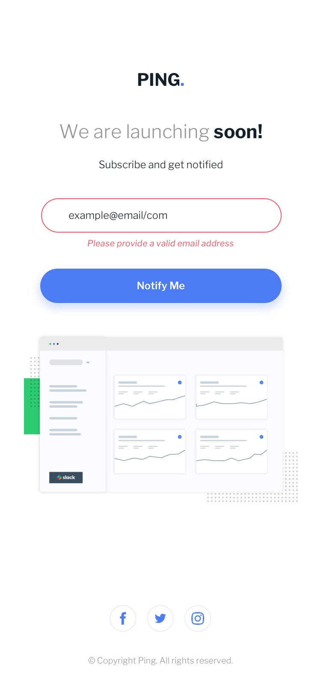
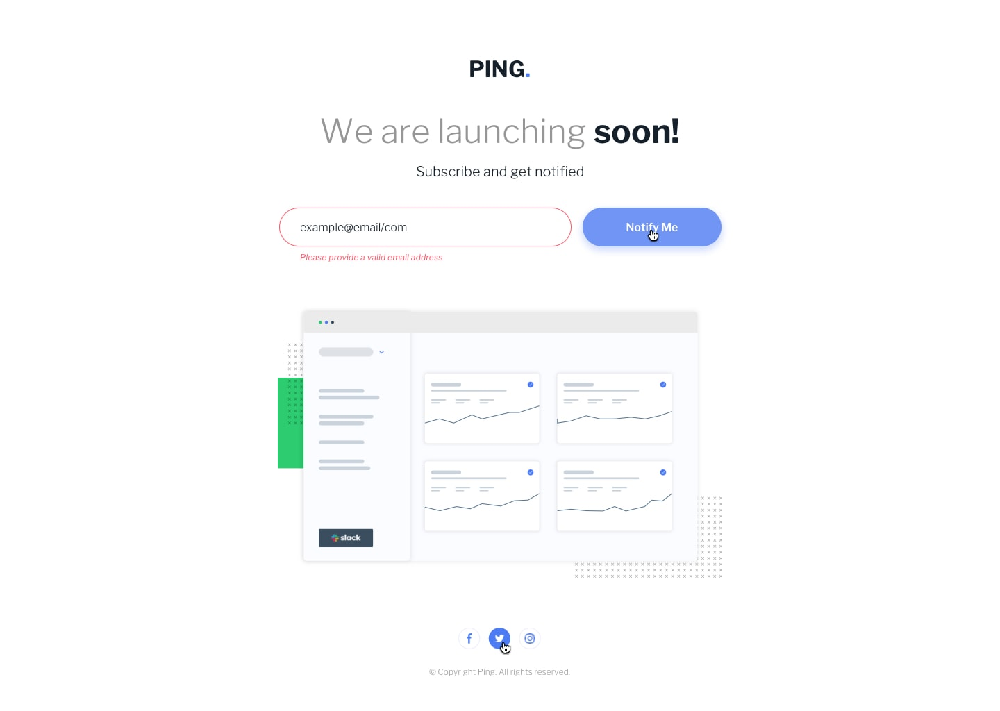
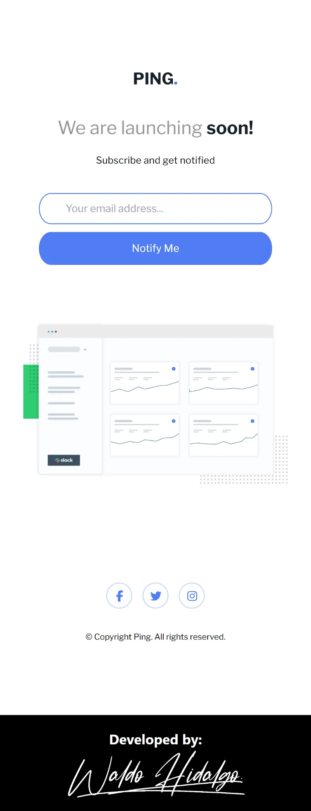
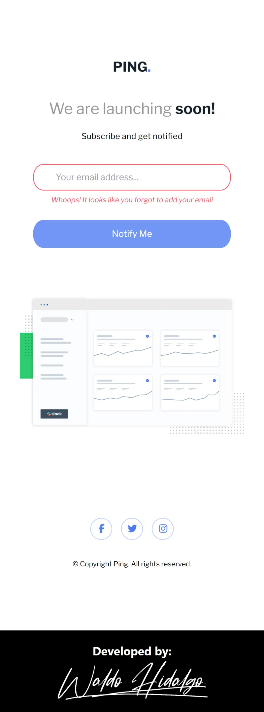
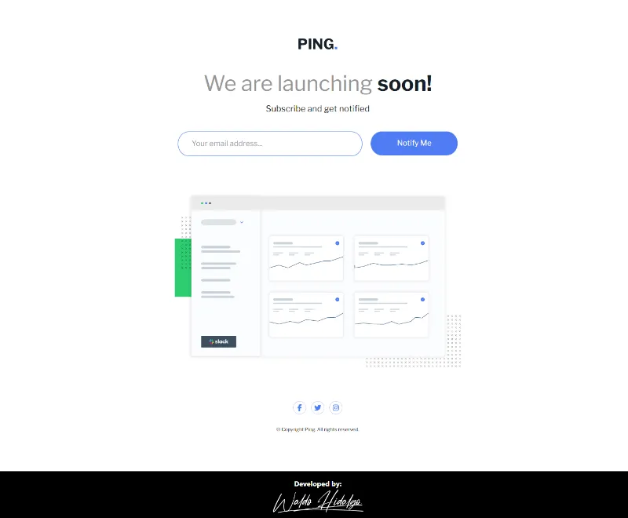
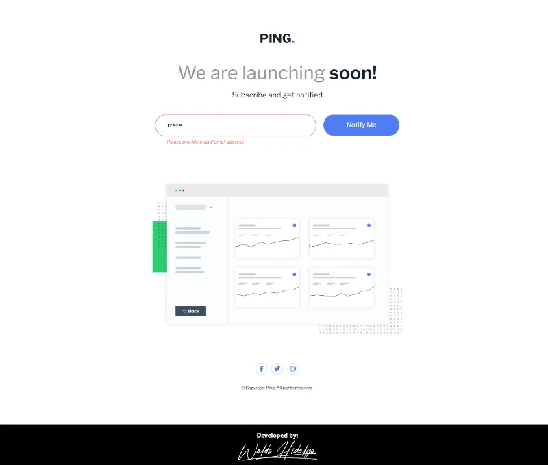

# Ping coming soon page

Repositorio con el código solución al challenge: [Ping coming soon page challenge on Frontend Mentor](https://www.frontendmentor.io/challenges/ping-single-column-coming-soon-page-5cadd051fec04111f7b848da).

## Tabla de Contenidos

- [Ping coming soon page](#ping-coming-soon-page)
  - [Tabla de Contenidos](#tabla-de-contenidos)
  - [The challenge](#the-challenge)
  - [Diseños a Replicar](#diseños-a-replicar)
    - [1-Mobile Design](#1-mobile-design)
    - [2-Mobile Error State Design](#2-mobile-error-state-design)
    - [3-Desktop Design](#3-desktop-design)
    - [4-Desktop Error State Design](#4-desktop-error-state-design)
  - [Proyecto Realizado](#proyecto-realizado)
    - [1-Mobile Size](#1-mobile-size)
    - [2-Mobile Error State: Empty Input](#2-mobile-error-state-empty-input)
    - [3-Desktop Size](#3-desktop-size)
    - [4-Desktop Error State: Wrong Email Pattern](#4-desktop-error-state-wrong-email-pattern)

## The challenge

El challenge consiste en realizar lo siguiente:

> Users should be able to:
>
> - View the optimal layout for the site depending on their device's screen size
> - See hover states for all interactive elements on the page
> - Submit their email address using an `input` field
> - Receive an error message when the `form` is submitted if:
>
>   - The `input` field is empty. The message for this error should say _"Whoops! It looks like you forgot to add your email"_
>   - The email address is not formatted correctly (i.e. a correct email address should have this structure: `name@host.tld`). The message for this error should say _"Please provide a valid email address"_

## Diseños a Replicar

### 1-Mobile Design

### 2-Mobile Error State Design

### 3-Desktop Design

### 4-Desktop Error State Design

## Proyecto Realizado

### 1-Mobile Size

### 2-Mobile Error State: Empty Input

### 3-Desktop Size

### 4-Desktop Error State: Wrong Email Pattern

